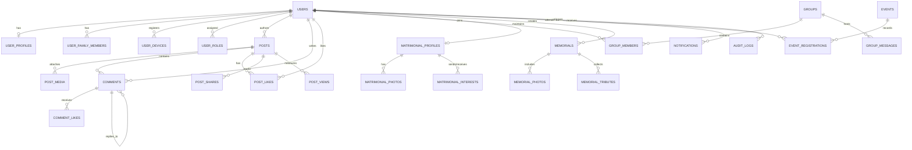

# Samaj Portal - Enterprise Community Management Platform
## System Architecture & Technical Specification

**Version:** 1.0.0-PROD  
**Author:** Senior Software Architect & Database Designer  
**Platform Scope:** Web (React + MUI), Mobile (React Native), Backend (Node.js/Express + PostgreSQL + Prisma + Redis + Socket.IO)

---

## 1. Architectural Review & Strategic Enhancements

### 1.1 What the Current Prompt Gets Right
- Comprehensive domain coverage: Authentication, Profiles, Social Feeds, Groups, Real-time Chat, Matrimonial, Memorials, Events, RBAC, and Audit Logging.
- Modern, scalable stack: Node.js + Express + Prisma + PostgreSQL + Redis + Socket.IO.
- Decoupled client strategy: Web (React + Redux Toolkit + MUI) and Mobile (React Native).

### 1.2 Recommended Critical Additions (Indian Samaj Realities)
1. **Member Verification Workflow (KYC/Samaj Approval)**:
   - An open registration model leads to fake accounts and spam.
   - *Addition*: `verification_status` (`PENDING_APPROVAL`, `VERIFIED_MEMBER`, `REJECTED`, `SUSPENDED`) with admin review & verification badge.
2. **Blood Donation & Emergency SOS Directory**:
   - The most utilized feature during family emergencies in Indian communities.
   - *Addition*: Dedicated `blood_donations` table, emergency SOS alerts to matching donors in the same city.
3. **Donation & Sahyog Nidhi (Fundraising & Transparency)**:
   - Community festivals, temple renovations, educational scholarships, and medical aid funds.
   - *Addition*: `donations`, `donation_campaigns`, automated receipt generation.
4. **Matrimonial Privacy & Contact Shielding**:
   - Phone numbers and photos should have privacy toggles (`VISIBLE_TO_ALL`, `ON_INTEREST_ACCEPT`, `HIDDEN`).
   - Kundli/Horoscope PDF attachment support.
5. **Database Normalization (Fixing Redundancy)**:
   - In the initial prompt, `member_directory` was listed as a separate table. Maintaining a separate directory table causes synchronization bugs.
   - *Architectural Fix*: Implement directory search via optimized PostgreSQL composite indexes and text-search vectors directly on `users` + `user_profiles`, or a PostgreSQL Materialized View refreshed via Redis cache.
6. **Soft Deletes & Auditability**:
   - Ensure all user-generated content has `deleted_at` (soft delete) to comply with legal audit trails.

---

## 2. Global Monorepo & Multi-Tier Folder Structure

```
Samaj_Portal/
├── backend/
│   ├── prisma/
│   │   ├── schema.prisma              # Production Prisma Schema
│   │   └── migrations/                # Database migration history
│   ├── src/
│   │   ├── config/                    # DB, Redis, FCM, S3, JWT configs
│   │   │   ├── env.config.js
│   │   │   ├── database.js
│   │   │   ├── redis.js
│   │   │   ├── storage.js
│   │   │   └── socket.js
│   │   ├── database/                  # Prisma client singleton & seeders
│   │   │   ├── prisma.js
│   │   │   └── seed.js
│   │   ├── middleware/                # Security, Auth, Upload, Error handlers
│   │   │   ├── auth.middleware.js
│   │   │   ├── rbac.middleware.js
│   │   │   ├── rateLimiter.middleware.js
│   │   │   ├── upload.middleware.js
│   │   │   ├── validate.middleware.js
│   │   │   └── error.middleware.js
│   │   ├── sockets/                   # Real-time namespaces & handlers
│   │   │   ├── chat.socket.js
│   │   │   ├── notification.socket.js
│   │   │   └── presence.socket.js
│   │   ├── utils/                     # Helpers, response builders, cryptography
│   │   │   ├── apiResponse.js
│   │   │   ├── apiError.js
│   │   │   ├── token.util.js
│   │   │   └── otp.util.js
│   │   ├── services/                  # Shared external services
│   │   │   ├── sms.service.js
│   │   │   ├── mail.service.js
│   │   │   ├── fcm.service.js
│   │   │   ├── redis.service.js
│   │   │   └── s3.service.js
│   │   ├── modules/                   # Domain-Driven Feature Modules
│   │   │   ├── auth/
│   │   │   │   ├── auth.controller.js
│   │   │   │   ├── auth.service.js
│   │   │   │   ├── auth.routes.js
│   │   │   │   └── auth.validation.js
│   │   │   ├── users/
│   │   │   ├── profiles/
│   │   │   ├── directory/
│   │   │   ├── posts/
│   │   │   ├── comments/
│   │   │   ├── likes/
│   │   │   ├── shares/
│   │   │   ├── groups/
│   │   │   ├── group-chat/
│   │   │   ├── matrimonial/
│   │   │   ├── memorials/
│   │   │   ├── events/
│   │   │   ├── announcements/
│   │   │   ├── blood-donation/        # [NEW ADDITION]
│   │   │   ├── donations/             # [NEW ADDITION]
│   │   │   ├── notifications/
│   │   │   ├── rbac/
│   │   │   ├── reports/
│   │   │   ├── audit/
│   │   │   └── settings/
│   │   ├── app.js                     # Express app configuration
│   │   └── server.js                  # HTTP + Socket.IO server bootstrapper
│   ├── .env.example
│   ├── Dockerfile
│   └── package.json
│
├── frontend/                          # React.js + Material UI + Redux Toolkit
│   ├── public/
│   ├── src/
│   │   ├── assets/                    # Images, icons, fonts, brand logos
│   │   ├── config/                    # API endpoints, theme constants
│   │   ├── theme/                     # MUI custom palette (rich royal community theme)
│   │   ├── layouts/                   # MainLayout, AuthLayout, DashboardLayout
│   │   ├── components/                # Reusable atoms, molecules & organisms
│   │   │   ├── common/                # Navbar, Sidebar, Footer, Modals, Loader
│   │   │   ├── feed/                  # PostCard, CreatePost, PollWidget
│   │   │   ├── chat/                  # ChatBox, MessageBubble, MemberList
│   │   │   ├── matrimonial/           # ProfileCard, FilterSidebar, BiodataModal
│   │   │   └── directory/             # DirectorySearch, MemberCard
│   │   ├── pages/                     # Routed view components
│   │   │   ├── auth/
│   │   │   ├── feed/
│   │   │   ├── directory/
│   │   │   ├── matrimonial/
│   │   │   ├── memorial/
│   │   │   ├── events/
│   │   │   ├── groups/
│   │   │   ├── blood-bank/
│   │   │   ├── donations/
│   │   │   └── admin/
│   │   ├── redux/                     # Slices, store, thunks
│   │   │   ├── store.js
│   │   │   ├── slices/
│   │   ├── services/                  # Axios HTTP clients & interceptors
│   │   ├── hooks/                     # Custom hooks (useAuth, useSocket, useDebounce)
│   │   ├── routes/                    # Protected & Public Route guards
│   │   ├── App.jsx
│   │   └── main.jsx
│   ├── package.json
│   └── vite.config.js
│
├── mobile_app/                        # React Native + Redux Toolkit + Navigation
│   ├── src/
│   │   ├── assets/
│   │   ├── components/
│   │   ├── navigation/                # RootNavigator, BottomTabs, AuthStack
│   │   ├── screens/
│   │   ├── redux/
│   │   ├── services/
│   │   ├── hooks/
│   │   └── theme/
│   └── package.json
│
├── docker-compose.yml                 # Local dev orchestration (PostgreSQL, Redis)
└── README.md
```

---

## 3. Database ER Model & Relationships (Mermaid)



---

## 4. Redis Caching & Invalidation Architecture

1. **Member Directory Caching**:
   - `KEY: samaj:directory:city:{cityId}:page:{page}` -> TTL: 15 mins
   - Invalidation: Cache bust on `user_profiles` update via Redis tag or pub/sub.
2. **Social Feed (Fanout on Read)**:
   - `KEY: samaj:feed:global:page:{page}` -> TTL: 2 mins (cached for fast pagination).
   - Invalidation: New post insertion prepends ID to feed list or evicts Page 1.
3. **Session & Token Blacklist**:
   - `KEY: samaj:jwt:blacklist:{jti}` -> TTL: Remaining JWT lifespan.
4. **Rate Limiting Counters**:
   - `KEY: samaj:ratelimit:ip:{ip}:endpoint:{route}` -> TTL: 60s sliding window.
5. **Real-time User Presence**:
   - `KEY: samaj:presence:user:{userId}` -> Hash (status, last_active, socket_id).
